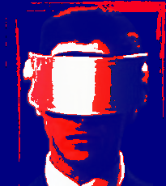
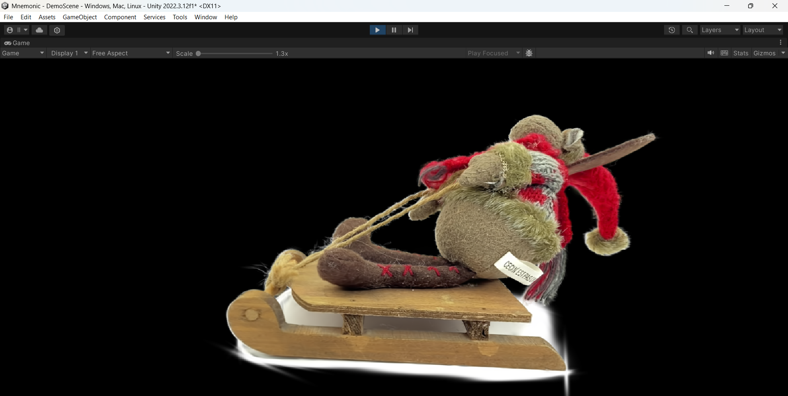
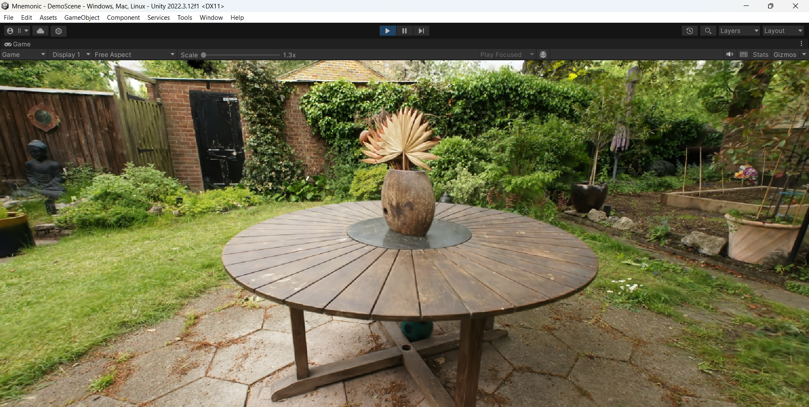

## Project Mnemonic

# 3D Gaussian Splatting in Unity Engine
This project implements a real-time 3D Gaussian Splatting visualization system for the Unity engine. It allows for efficient rendering of photogrammetric data, offering high visual quality and competitive performance compared to reference implementations, while seamlessly integrating with built-in rendering pipeline.

## Table of Contents
* [Introduction](#introduction)
* [Features](#features)
* [Technical Details](#technical-details)
    * [3D Gaussian Splatting Method](#3d-gaussian-splatting-method)
    * [PLY File Parsing](#ply-file-parsing)
    * [GPU Data Sorting](#gpu-data-sorting)
    * [Rendering Algorithm](#rendering-algorithm)
* [Installation and Usage](#installation-and-usage)
* [Demos](#demos)
* [Performance](#performance)

## Introduction
Modern computer graphics specialists often face challenges in populating virtual worlds with unique, high-quality objects and scenes. This project addresses these challenges by providing a robust and efficient 3D Gaussian Splatting solution specifically designed for the Unity platform. The system enables developers to integrate complex real-world captures into their Unity projects with high fidelity and performance.

## Features
  * **Efficient PLY Data Loading:** Custom-built object-oriented parser for optimized loading of 3D Gaussian Splatting data from [PLY files](https://en.wikipedia.org/wiki/PLY_(file_format)).
  * **GPU-Accelerated Sorting:** Implements both Bitonic Sort and Radix Sort algorithms on the GPU for efficient real-time sorting of Gaussians based on camera distance.
  * **High-Quality Gaussian Rendering:** Optimized HLSL shaders for fast and accurate Gaussian rendering.
  * **Seamless Unity Integration:** Packaged as a `.unitypackage` for easy import, with a user-friendly inspector interface for controlling rendering parameters.
  * **Hybrid Scene Support:** Correctly composites Gaussian splats with traditional 3D geometry, resolving depth issues and blending artifacts.
  * **Configurable Rendering Modes:** Supports "Splats" for full Gaussian rendering and "Points" for lightweight visualization of central points.
  * **Dynamic Parameter Control:** Allows real-time modification of Gaussian scale, spherical harmonics degree, and sorting frequency.
  * **Performance Parity:** Achieves comparable, and in some cases superior, performance to the reference 3D Gaussian Splatting implementation.

## Technical Details
### 3D Gaussian Splatting Method
The core of this system is the [3D Gaussian Splatting method](https://repo-sam.inria.fr/fungraph/3d-gaussian-splatting/). It approximates scene geometry using a set of differentiable 3D Gaussians, optimized from [Structure from Motion (SfM)](https://en.wikipedia.org/wiki/Structure_from_motion) output.

### PLY File Parsing
[A custom object-oriented parser](Assets/Mnemonic/Scripts/Ply/BinaryPlyReader.cs) is implemented to read and process PLY files containing optimized [Gaussian data](Assets/Demos/header.ply). The parser efficiently handles scalar properties and provides a flexible `GetData<T>()` method for reinterpreting raw binary data into [user-defined structures](Assets/Mnemonic/Scripts/Ply/Data/GaussianData.cs).

### GPU Data Sorting
To ensure correct alpha blending, Gaussians must be sorted by distance to the active camera. Two GPU-accelerated sorting algorithms are implemented:

  * [**Bitonic Sort:**](https://en.wikipedia.org/wiki/Bitonic_sorter) An adapted version of Unity Technologies' Bitonic Sort, modified to handle floating-point distances by mapping them to unsigned integers.
  * [**Radix Sort:**](https://en.wikipedia.org/wiki/Radix_sort) A highly efficient counting-based sort with linear time complexity, offering significant performance improvements in many scenarios. 

> [!NOTE]  
> Radix Sort requires DirectX 12 support, while Bitonic Sort is compatible with DirectX 11.

### Rendering Algorithm
The rendering pipeline is implemented using HLSL compute and graphics shaders, orchestrated by C\# scripts in Unity.

1.  **Initialization:** Gaussian data is loaded into GPU buffers.
2.  **[Parameter Computation](Assets/Mnemonic/Shaders/GSRoutines.compute#L64):** A compute shader processes Gaussian data, transforming 3D Gaussians into 2D screen-space representations. This involves:
      * Constructing combined rotation and scale matrix.
      * Calculating 3D and 2D covariance matrices.
      * Applying a low-pass filter to the 2D covariance matrix to ensure that it is invertible.
      * Computing conic matrix (the inverse of $\Sigma'$).
      * [Calculating Gaussian color](Assets/Mnemonic/Shaders/GaussianSplatting.hlsl#L48) based on view direction.
      * Packing computed data into `GSViewData` buffer.
3.  **[Splats Rendering](Assets/Mnemonic/Shaders/RenderSplats.shader):**
      * **Vertex Shader:** Extracts Gaussian data from the sorted buffer, calculates screen-space positions, and constructs a quad around each Gaussian's center, scaled by its radius.
      * **Fragment Shader:** Computes Gaussian density based on the conic matrix and mixes colors using standard alpha blending, where the combined pixel color $C$ is calculated as:
        $$C = \sum_{i \in N} c_i \alpha_i \prod_{j=1}^{i-1} (1-\alpha_j)$$
4.  **[Compositing](Assets/Mnemonic/Shaders/Composite.shader):** To enable seamless integration with Unity's standard 3D rendering pipeline and resolve depth issues, a compositing pass is implemented:
      * Gaussians are first rendered to a temporary RGBA [render texture](https://docs.unity3d.com/2022.3/Documentation/Manual/class-RenderTexture.html) with a transparent background.
      * This temporary texture is then composited onto the main camera's frame buffer, converting colors from gamma to linear space. This ensures correct visual layering of Gaussians with regular Unity objects.

## Installation and Usage
1.  **Dependencies:** This project relies on a [Radix Sort implementation](https://github.com/b0nes164/GPUSorting) that is best installed via Unity's Package Manager. 
      * Open the Package Manager and add the required dependency from git URL: `https://github.com/b0nes164/GPUSorting.git?path=/GPUSortingUnity`
2.  **Import Package:**
      * In Unity, go to `Assets > Import Package > Custom Package...`.
      * Select the provided `.unitypackage` file for this project.
      * Ensure all assets are selected and click `Import`.
3.  **Import PLY Files:**
      * After installation, a new menu item will appear: `Tools > Create GaussianData Asset`.
      * Use this tool to import your `.ply` files (generated by the 3D Gaussian Splatting optimization step) into your Unity project.
4.  **Add Gaussian Renderer:**
      * Navigate to the `Prefabs` subdirectory within the imported assets.
      * Drag and drop the "Gaussian Renderer" prefab into your scene.
5.  **Configure Renderer:**
      * Select the "Gaussian Renderer" GameObject in your scene.
      * In the Inspector, assign your imported `GaussianData Asset` to the `Gaussian Data Asset` field.
      * Adjust other parameters in the `Shaders`, `Sorting`, and `Modifiers` sections as needed.
          * **Rendering Mode:** Choose between "Splats" (full rendering) and "Points" (center points only).
          * **Scale Modifier:** Adjust the size of Gaussians.
          * **SH Degree:** Set the maximum order of spherical harmonics for color calculation.
          * **Sort N Frames:** Control the frequency of Gaussian sorting.

## Demos

## Performance
The system's performance was evaluated using the Frames Per Second (FPS) metric across various scenes and GPU configurations. The results of this evaluation are shown in a table below. In the table, the numerator represents the FPS achieved by this system, while the denominator shows the FPS of the reference implementation.

| GPU / Scene           | **toy (7k)** | **stump (7k)** | **stump (30k)** | **garden (7k)**| **garden (30k)** | **bicycle (7k)** | **bicycle (30k)** |
| :-------------------- | :----------: | :------------: | :-------------: | :------------: | :--------------: | :--------------: | :---------------: |
| NVIDIA Quadro GV100   | **261**/63   | **85**/62      | **70**/60       | **80**/41      | **58**/45        | **72**/31        | **47**/31         |
| NVIDIA RTX 3070M      | **139**/144  | **69**/84      | **53**/67       | **57**/67      | **43**/53        | **60**/69        | **37**/42         |
| NVIDIA RTX 2060 Super | **160**/242  | **70**/77      | **53**/60       | **56**/60      | **44**/47        | **44**/61        | **29**/39         |

These results highlight the system's efficiency and suitability for real-time applications within Unity.
